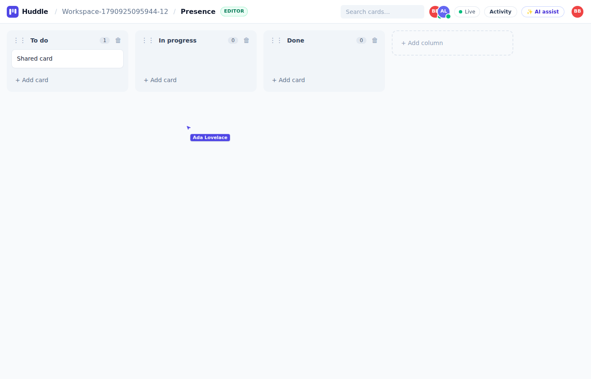
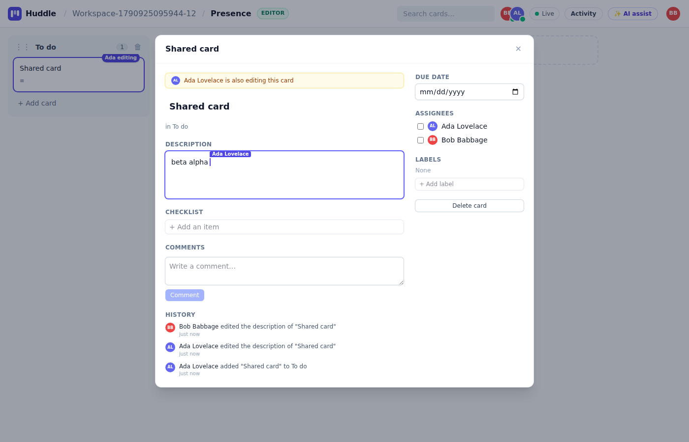
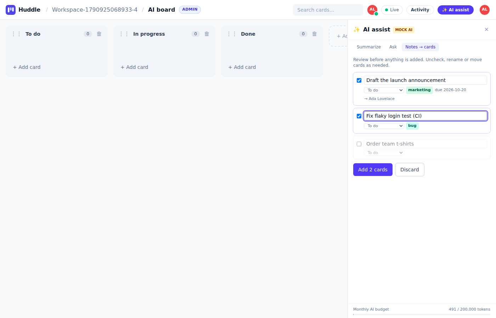
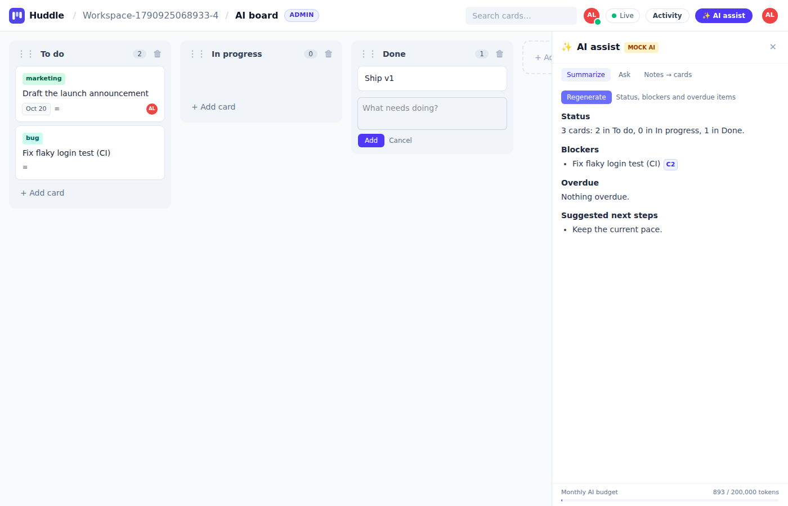
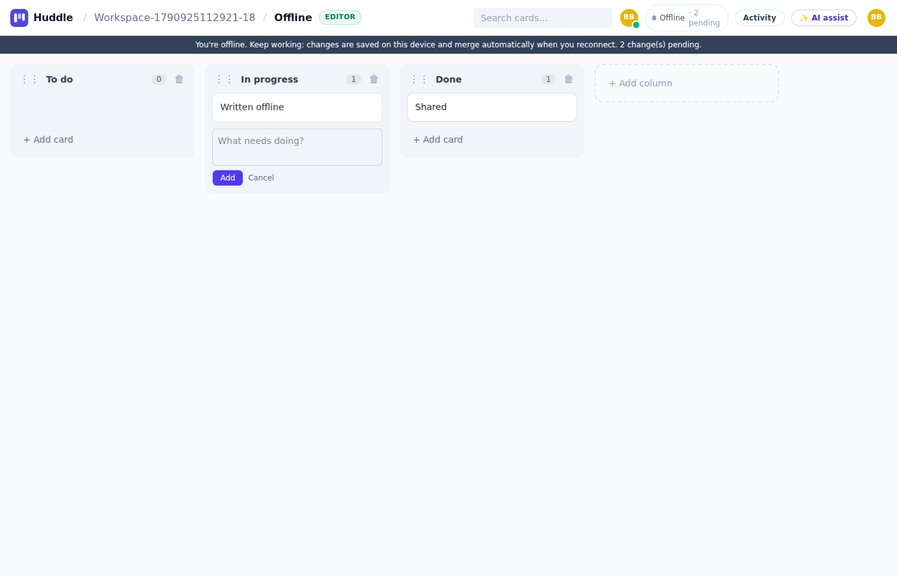
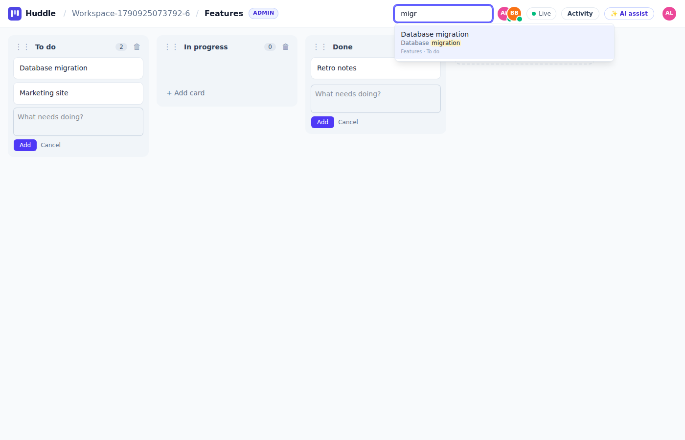
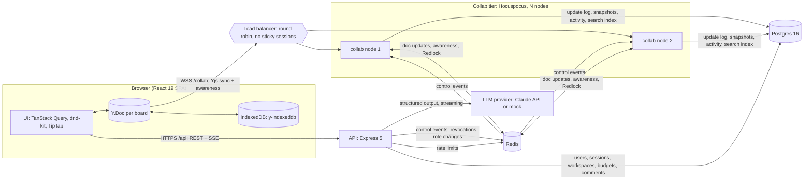
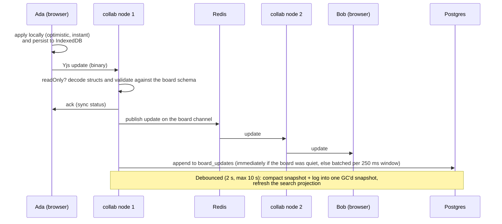

# Huddle

A real-time collaborative kanban board with AI assist. Several people can edit the same board
at once: drag cards, type in the same description, see each other's cursors, and keep working
offline. The AI turns meeting notes into cards (you review them before they are added),
streams a board summary, and answers questions about the board with clickable citations.

The project goes for depth over breadth. The interesting parts are:

- **Sync.** CRDT sync that converges, plus a server that checks every edit.
- **Persistence.** Snapshot plus update-log storage.
- **Scaling.** Horizontal scaling with no sticky sessions, backed by a real k6 run.
- **AI.** Calls that are validated, grounded, budgeted and rate limited.

| Live cursors and presence                                                 | Concurrent typing in one description                                                            |
| ------------------------------------------------------------------------- | ----------------------------------------------------------------------------------------------- |
|  |  |
| **AI: review proposed cards before inserting**                            | **AI: streamed summary with citations**                                                         |
|            |                               |
| **Offline editing**                                                       | **Full-text search**                                                                            |
|      |                                   |

The screenshots are captured by the Playwright suite (`E2E_SCREENSHOT_DIR=docs/screenshots pnpm test:e2e`).

## Contents

- [Live demo and demo accounts](#live-demo-and-demo-accounts)
- [Features](#features)
- [Architecture](#architecture)
- [Why a CRDT (and not OT or last-writer-wins)](#why-a-crdt-and-not-ot-or-last-writer-wins)
- [Persistence and compaction](#persistence-and-compaction)
- [How scaling works](#how-scaling-works)
- [Permissions and security](#permissions-and-security)
- [AI design](#ai-design)
- [Search and activity log](#search-and-activity-log)
- [Observability](#observability)
- [Load test (k6)](#load-test-k6)
- [Testing](#testing)
- [Running locally](#running-locally)
- [Deploying](#deploying)
- [Repository layout](#repository-layout)
- [Trade-offs and what I would do next](#trade-offs-and-what-i-would-do-next)
- [Architecture decision records](#architecture-decision-records)

## Live demo and demo accounts

**Live demo: not deployed yet.** This repository was built in a sandbox with no Fly.io or Vercel
credentials, so there is no public URL to link. I'd rather say so than link a URL that doesn't
work. The [Deploying](#deploying) section has the exact commands and config files
(`deploy/fly.api.toml`, `deploy/fly.collab.toml`, `apps/web/vercel.json`). The full
production topology (two collab nodes behind a round-robin balancer) also runs locally with
`pnpm dev:cluster` or `docker compose --profile full up`.

**Demo accounts** are created by `pnpm db:seed`. The seed is idempotent and creates a
"Huddle Demo" workspace with a "Launch plan" board:

| Account             | Password           | Role   | Shows                                  |
| ------------------- | ------------------ | ------ | -------------------------------------- |
| `demo@huddle.dev`   | `huddle-demo-2026` | Admin  | everything                             |
| `viewer@huddle.dev` | `huddle-demo-2026` | Viewer | read-only mode, enforced by the server |

Set `DEMO_PASSWORD` before seeding a public deployment.

## Features

**Accounts and workspaces**

- Email and password sign-up. Passwords are hashed with argon2id.
- Short-lived access JWTs plus a rotating httpOnly refresh token with reuse detection.
- A session list and **log out everywhere**, which also closes that user's open WebSockets
  on every collab node.
- Workspaces with `ADMIN` / `EDITOR` / `VIEWER` roles.
- Invite links that are tokenized, expiring, limited in uses and carry a role. Only a hash of
  the token is stored.
- Role changes and removals take effect live on open sockets.

**Boards (real time)**

- Columns and cards with labels, due dates, assignees, checklists and a rich-text description
  (TipTap). Several people can type in the same description at once.
- Drag and drop for cards and columns (dnd-kit), including keyboard dragging:
  - Space to lift, arrows to move, and Left/Right to jump between columns
  - screen-reader announcements
- Presence:
  - avatars of who is on the board
  - live mouse cursors
  - "Ada editing" and "Ada moving" badges on cards
  - colored text carets inside descriptions
- Offline: the board is cached in IndexedDB (y-indexeddb), so it opens and stays editable
  without a connection and merges on reconnect. An offline banner shows pending changes.
  Reconnects use exponential backoff with jitter, and a status pill shows
  Live / Connecting / Reconnecting (attempt n) / Offline.
- An activity log ("Ada moved _Fix login_ from To do to Done") derived from the CRDT
  transactions.
- Comments on cards.

**AI**

- Notes → cards: you review, edit or uncheck the proposals, then insert them.
- A streamed board summary.
- "Ask the board" with citations that open the cited card.
- Per-user rate limit and a monthly token budget, shown as a meter in the UI.

**Search**

- Postgres full-text search across every board in a workspace, with highlighted matches.

## Architecture



There are three deployable services, built from one `Dockerfile`:

| Service       | Owns                                                                                                                                                                        |
| ------------- | --------------------------------------------------------------------------------------------------------------------------------------------------------------------------- |
| `apps/web`    | The SPA. Board content lives in a Y.Doc. Metadata (workspaces, members, boards list, comments, search, AI) goes through REST with TanStack Query.                           |
| `apps/api`    | Auth, workspaces, invites, board metadata, comments, activity and search queries, and AI. It is stateless, so it scales by adding instances.                                |
| `apps/collab` | Hocuspocus WebSocket server: auth, per-message permission checks, update validation, persistence, activity derivation and search projection. Two or more nodes share Redis. |

`packages/shared` holds the parts both sides must agree on:

- the permission matrix
- Zod schemas for every API boundary, the awareness state and AI outputs
- the Yjs board model (`board/model.ts`), which both the UI and the server-side validator use

`packages/db` holds the Drizzle schema, migrations and the board persistence functions.

The life of one edit, with two users on different nodes:



## Why a CRDT (and not OT or last-writer-wins)

Full reasoning: [ADR 0001](docs/adr/0001-crdt-yjs-for-board-state.md).

- **Last-writer-wins rows** lose text. When two people edit a description at the same time,
  one of them silently loses their work. Offline editing would need its own queue and
  conflict resolution.
- **Operational transformation** needs a central sequencer per document and a transform
  function for every pair of operations, which is a lot of correctness-critical code for
  maps, lists, rich text and moves. Long offline sessions are expensive to transform. With
  several servers, every edit for a document must still pass through one sequencer.
- **A CRDT (Yjs)** applies updates in any order, any number of times, and every replica
  converges. That one property gives us:
  - offline support (IndexedDB)
  - multi-node fan-out over an unordered bus (Redis)
  - storage that merges instead of overwriting
  - no sequencer anywhere

Converging is not enough on its own; the merged state also has to make sense. These choices in
the board model (`packages/shared/src/board/model.ts`) make concurrent edits merge sensibly:

- **Columns and cards are id-keyed maps**, not arrays. Adding cards never conflicts.
- **Order is a fractional index** stored on the item. A move is one write, not delete plus
  insert. With a `Y.Array`, two people moving the same card at once would duplicate it.
- **A card's position is one atomic field** `pos: {columnId, order}`. If column and order were
  separate keys, two concurrent moves could merge into the column from one move and the order
  from the other. As one value, a move wins or loses as a whole, and ties sort by id so every
  replica shows the same order.
- **Descriptions are `Y.XmlFragment`** bound to TipTap, so concurrent typing merges by
  character.
- **Orphans are rendered, not dropped.** If one user moves a card into a column while another
  deletes that column, the card shows in the first column.

## Persistence and compaction

Full reasoning: [ADR 0002](docs/adr/0002-snapshot-plus-update-log-persistence.md).

- **Write path.** Each client update is appended to `board_updates` by the node that received
  it. Updates relayed over Redis are not logged again, so each edit is logged exactly once.
  An integration test checks this. The write is throttled with a leading edge: the first edit
  after a quiet period is inserted immediately, and a burst becomes one insert per 250 ms
  window.
- **Compaction.** Debounced at 2 s, and at most every 10 s. It runs in one transaction:
  1. `SELECT … FOR UPDATE` on the snapshot row.
  2. Apply snapshot + log rows + the node's in-memory state into a fresh **GC-enabled**
     `Y.Doc` and re-encode it.
  3. Delete exactly the log rows that were read.

  Using a GC'd doc instead of `Y.mergeUpdates` matters: `mergeUpdates` keeps the content of
  deleted items forever, so the snapshot would grow with churn. GC drops it.

- **Load path** = snapshot + every remaining log row.
- **Why this is safe without more coordination.** Yjs updates are idempotent and
  commutative. An update that is in both the snapshot and the log is harmless, and two nodes
  compacting at once each delete only rows they folded in. An update is therefore always in
  the log, the snapshot, or both.
- **Effect.** A crash loses at most one 250 ms batch instead of up to 10 s of edits.
  Snapshot size follows live content plus small tombstones.

## How scaling works

Full reasoning: [ADR 0003](docs/adr/0003-horizontal-scaling-redis-no-sticky-sessions.md).

Collab nodes are interchangeable and the load balancer is plain round robin. There are no
sticky sessions; any node can serve any board.

- **Fan-out.** `@hocuspocus/extension-redis` publishes each applied update on the board's
  Redis channel. Other nodes holding that board apply it and forward it to their clients.
  Awareness (presence) goes the same way.
- **Gap repair instead of reliable delivery.** When a node loads a board it exchanges state
  vectors with its peers over Redis and receives whatever it is missing. A lost pub/sub
  message is repaired at the next exchange. This is why a late joiner on node B sees edits
  that node A has not persisted yet (covered by an integration test).
- **One compactor at a time.** A Redlock lock around storing means normally one node compacts
  a board. If the lock lapses, two compactions are still safe (see above).
- **Control plane.** The API publishes events on `huddle:server-events`, and every node acts on
  its own sockets:
  - `sessions-revoked`: close the sockets for "log out everywhere".
  - `membership-changed`: flip `connection.readOnly`, so a demoted editor's next write is
    rejected without a reconnect.
  - `board-deleted`.
- **Verified.** `apps/collab/test/scaling.int.test.ts` runs two real servers sharing Redis and
  Postgres. Clients deliberately connect to different nodes. The tests check:
  - concurrent bursts from both nodes converge to the same state vector
  - a late joiner gets unpersisted state from its peer
  - each update is logged exactly once
  - presence crosses nodes
  - control events reach sockets on every node

  The Playwright suite also runs against two nodes behind the round-robin balancer, and the
  k6 test below measures it under load.

The cost: a board open on N nodes is held in memory N times, and Redis is in the hot path. If
Redis goes down, each node keeps serving its own clients consistently, and the nodes reconcile
when Redis comes back.

## Permissions and security

**Checks happen on the server, on every message**

- The permission matrix lives in `packages/shared/src/permissions.ts` and is used by both the
  API and collab.
- On connect, the collab node checks:
  - the JWT signature and expiry
  - that the **session is still live** in Postgres, so logout and revocation apply to sockets
  - workspace membership and role
- Viewers get a read-only connection. Every incoming Yjs update is decoded at the struct level
  (`packages/shared/src/board/validate-update.ts`) and checked against the board schema
  before it is applied:
  - an update from a read-only socket is dropped and counted in
    `collab_rejected_writes_total{reason="read_only"}`
  - an invalid update closes the connection

  This matters because a CRDT accepts anything a client sends.

- Awareness states are re-stamped with the authenticated identity, so nobody can impersonate
  another user's presence.

**Sessions**

- Access tokens last 15 minutes and are held in memory only. Every request also checks that
  the session behind the token is live.
- The refresh token is httpOnly, `SameSite=Strict`, scoped to `/api/auth`, and rotated on every
  use.
- Rotation runs under `SELECT … FOR UPDATE`. Presenting an already-rotated token is treated
  as theft and revokes the whole session family.
- Several tabs refreshing at once would trip that reuse detection, so tabs serialize refresh
  through the Web Locks API and share the result.
- Cookie-authenticated endpoints also require an `X-Requested-With: huddle` header, as CSRF
  defense in depth.

**Validation and limits**

- Zod validates every boundary: env config, request bodies and params, awareness state,
  stateless messages, AI outputs and SSE events.
- Redis-backed rate limits (`rate-limiter-flexible`, with an in-memory fallback if Redis is
  down):
  - login: 10 per 15 min per IP and email
  - signup: 10 per hour per IP
  - refresh: 60 per minute
  - invite lookups: 30 per minute
  - AI: 10 per minute per user, configurable
- Invite and refresh tokens carry 256 bits of entropy, and only their SHA-256 hashes are
  stored.

**Secrets and endpoints**

- The client never sees a secret. The browser talks only to `/api` and `/collab`, and the
  Anthropic key lives only in the API's environment.
- The collab WebSocket authenticates with a token sent in its first message, not a cookie.
  Cross-site WebSocket hijacking has no ambient credential to abuse, so the server does not
  need an Origin allowlist.
- `/metrics` can be protected with `METRICS_TOKEN`.

## AI design

AI code lives in `apps/api/src/ai/`. Every AI call goes through `AiService`, and every provider
implements one small interface (`LlmProvider`: `completeJson`, `streamText`):

- `AnthropicProvider` uses the official SDK. Default model: `claude-opus-5-5`.
- `MockProvider` is deterministic and is the default. It powers local dev, CI and e2e, so tests
  never spend tokens and never flake on model output. It also has hooks to inject failures:
  `[[mock:malformed-once]]`, `malformed-always`, `slow`, `refuse` and `hallucinate`.

**Notes → cards (structured output, validated, reviewed)**

1. The request uses structured outputs (`output_config.format` with a JSON schema), so the
   model is constrained to the shape.
2. **Zod is the source of truth.** The JSON schema only describes the shape. Lengths, date
   format, enums and the 25-card cap are enforced by `proposedCardSchema` after parsing.
3. If the output does not parse or validate, there is **one corrective retry**: the model sees
   its own answer and the exact Zod issues. A second failure is a clean 502
   (`ai_invalid_output`), never a half-parsed result.
4. The server resolves model output against the real board. Column names become column ids
   and member names become user ids. Anything unknown becomes a visible warning ("'Zed' is
   not a board member, left unassigned"), never an invented id.
5. **A person reviews before anything is written.** Proposals are editable and can be
   unchecked. On accept, the _client_ inserts the cards into the Y.Doc. AI output therefore
   takes the same path as a human edit (CRDT, server validation, permission checks, activity
   log). The AI has no write path of its own.

**Summary and Ask (streamed, grounded, cited)**

- Responses stream over **SSE on a POST** response body. `EventSource` can only GET and
  cannot send an `Authorization` header, so the client parses the stream from `fetch`.
  Events are `meta`, `delta`, `citations`, `done`, `refusal` and `error`, and each is
  Zod-validated on the client.
- Grounding: the prompt contains the board, up to 200 cards. When a board is larger, cards are
  ranked by overlap with the question, then overdue first, then most recently updated. Descriptions are truncated to
  400 characters. Each card gets a short reference (`C1`…`Cn`) that the model must cite like
  `[C3]`.
- **Citations are validated on the server** against the context that was actually sent:
  - known references become chips that open the card
  - unknown references (hallucinated) are returned as `invalid` and shown struck through
- Board content and notes are untrusted. They are wrapped in `<board>` / `<notes>` tags, and
  the system prompt tells the model never to follow instructions inside them.

**Cost and failure controls**

- **Timeouts.** Each request has a deadline (`AI_TIMEOUT_MS`, 60 s), combined with the
  client's disconnect signal (`AbortSignal.any`). Closing the panel cancels the upstream
  request, so nobody pays for tokens nobody reads.
- **Retries.** The SDK retries once on 429, 5xx and connection errors. The service's own retry
  loop handles only invalid output.
- **Refusals.** The stop reason is checked before content is read. A refused stream tells the
  UI to discard the partial answer.
- **Server-side fallback.** `fallbacks: "default"` lets the API retry a request declined by a
  safety classifier on the recommended fallback model, inside the same call. It is on by
  default; set `AI_FALLBACKS=false` to turn it off.
- **Rate limit.** 10 requests per minute per user, in Redis.
- **Monthly token budget** (`AI_MONTHLY_TOKEN_BUDGET`, stored in Postgres `ai_usage`):
  - Uses **reserve-then-settle**. Before calling the model, one conditional upsert reserves
    the worst case: (estimated prompt + `max_tokens`) × attempts. It only succeeds if
    `used + reserved + estimate ≤ limit`, so concurrent requests cannot overspend.
  - Afterwards the reservation is released and the usage the provider reported is charged.
    Streams cut off midway are still charged for what was generated.
  - Exhausted budgets return 429 with the reset date.
- **Audit and metrics.** Every request writes an `ai_requests` row (feature, model, status,
  attempts, tokens, latency) and updates the `ai_*` Prometheus metrics.
- **Effort per feature.** Thinking is left at the model's adaptive default, and effort is set
  explicitly per feature: `medium` for extraction, `low` for summaries and Q&A.

**Freshness.** The AI reads the persisted board (snapshot + update log), not the collab
node's memory. That keeps the API stateless. Thanks to the leading-edge log write, a lone edit
is visible within milliseconds. During a burst the AI can trail by up to one 250 ms window.

**What was not tested here.** I made no live Claude API calls from this environment, because
there was no API key. The Anthropic provider is covered by contract tests against a local fake
of the Messages API (`anthropic.test.ts`): request shape, structured output, streaming,
refusals (including mid-stream), fallback parameters and error mapping. The full features are covered
end-to-end with the mock provider. To use Claude, set `AI_PROVIDER=anthropic` and
`ANTHROPIC_API_KEY`.

## Search and activity log

**Search** uses a read model, `card_search`, with one row per card:

- A generated, weighted `tsvector` (title A, labels B, description and checklist C) with a GIN
  index.
- The collab node refreshes it as part of compaction. It hashes each card, so only changed
  rows are written.
- Queries become prefix `tsquery`s built from sanitized tokens, so "flak log" matches
  "Fix flaky login test".
- Results are ranked with `ts_rank`, and matches are highlighted with `ts_headline`.
- Search is scoped to workspaces the caller belongs to.
- Search trails edits by at most the 10 s max debounce. That is fine for search, and it keeps
  indexing off the hot path.

**Activity** is derived from Yjs transactions on the collab node
(`packages/shared/src/board/activity.ts`):

- It is diffed into semantic events: card created, moved from X to Y, renamed, labelled,
  assigned, column added and so on.
- Each event is attributed to the connection's user and written once, by the node that
  received the edit.
- It is served with keyset pagination, and connected clients are told to refetch.

Typing in a description is coalesced. The log does not record one entry per keystroke.

## Observability

- **Logs.** Structured `pino` logs. Every HTTP request has a request id (echoed as
  `X-Request-Id`), and collab logs carry `instance`, `boardId` and `connId`.
- **Metrics.** Prometheus `/metrics` on the API and on every collab node, with default process
  metrics plus:

| Metric                                                                                   | Kind      | Meaning                                           |
| ---------------------------------------------------------------------------------------- | --------- | ------------------------------------------------- |
| `http_request_duration_seconds{method,route,status}`                                     | histogram | API latency by route template                     |
| `collab_active_connections`, `collab_documents_loaded`                                   | gauge     | sockets and boards in memory on this node         |
| `collab_messages_received_total`                                                         | counter   | inbound WebSocket messages                        |
| `collab_updates_applied_total{origin}`                                                   | counter   | updates applied, from local clients or from Redis |
| `collab_update_fanout_total`                                                             | counter   | update deliveries to sockets                      |
| `collab_rejected_writes_total{reason}`                                                   | counter   | `read_only` or `invalid` writes dropped           |
| `collab_auth_failures_total{reason}`                                                     | counter   | rejected connections                              |
| `collab_compaction_duration_seconds`, `collab_snapshot_bytes`                            | histogram | compaction cost and snapshot size                 |
| `collab_update_log_rows_total`, `collab_activity_events_total{type}`                     | counter   | update-log writes, activity events                |
| `ai_requests_total{feature,status}`, `ai_tokens_total{feature,direction}`                | counter   | AI outcomes and token spend                       |
| `ai_request_duration_seconds{feature,status}`, `ai_time_to_first_token_seconds{feature}` | histogram | AI latency, streaming responsiveness              |

Example queries:

```promql
# Messages per second across the collab tier
sum(rate(collab_messages_received_total[1m]))

# p95 API latency per route
histogram_quantile(0.95, sum by (le, route) (rate(http_request_duration_seconds_bucket[5m])))

# Viewers trying to write (should be ~0; a spike means a buggy or malicious client)
sum(rate(collab_rejected_writes_total{reason="read_only"}[5m]))

# Share of updates arriving via Redis, i.e. how much cross-node fan-out there is
sum(rate(collab_updates_applied_total{origin="redis"}[5m])) / sum(rate(collab_updates_applied_total[5m]))

# AI tokens per hour, and the share of AI requests failing
sum(increase(ai_tokens_total[1h]))
sum(rate(ai_requests_total{status!="ok"}[15m])) / sum(rate(ai_requests_total[15m]))
```

- **Errors.** Sentry is wired into the API, the collab nodes and the web app (React error
  boundary). It is enabled only when `SENTRY_DSN` / `VITE_SENTRY_DSN` is set, and unexpected
  5xx errors, compaction failures and update-log failures are captured with context.

## Load test (k6)

`load/ws-fanout.js` is a k6 script that speaks the real protocol. Each virtual user opens a
WebSocket and authenticates with a real JWT minted by `load/setup.mjs` through the API. It
then runs the Hocuspocus and Yjs sync handshake, like the browser does. Yjs and the shared
board model are bundled into the script with esbuild.

- **Clients.** 200 VUs connect over 20 s and stay connected. Like the browser provider, each
  sends an awareness heartbeat every 15 s.
- **Writers.** W of them add a card at H Hz for 30 s. Each card title embeds the send
  timestamp.
- **Fan-out latency.** Every client decodes each incoming update with Yjs. When a new probe
  card appears, it records `now − sentAt`. This covers:
  - the writer's send
  - server validation
  - the Redis hop when the receiver is on the other node
  - the receiver's decode
- **Dropped messages.** Expected deliveries minus received, where expected = probes × 199
  receivers. A client closed by the server shows up as drops.
- **Memory per connection.** Measured as heap used plus `external` (socket buffers live
  there) after a forced full GC. The bench-only `/debug/gc` endpoint requires
  `--expose-gc` and `BENCH_GC_ENDPOINT=true`. The value is
  (loaded − idle) ÷ connections, summed over nodes. RSS deltas came out negative after GC
  (the allocator keeps pages), so RSS is not used.

**Environment.** One VM with 4 vCPUs (Intel Xeon @ 2.80 GHz) and 15 GiB RAM. That single
machine ran **k6, both collab nodes, Postgres 16, Redis 7 and the API**. k6 v1.8.1, Node
v22.22. Every scenario gets fresh collab processes (production build). The two-node runs
spread clients round robin over both nodes, so about half of all deliveries cross Redis.
These are numbers from one shared box, not a cluster, so read them as relative rather than
as production capacity. Raw results are in `load/results/*.json`, and
`load/run-all.sh` reproduces them.

<!-- K6_TABLE:START -->

| Scenario (200 clients)                       | Synced    | Probes sent | Delivered / expected | Dropped | Unexpected closes | Fan-out p50 / p95 / p99 / max  | Time to sync p50 / p95 | Heap + external per connection (after GC) |
| -------------------------------------------- | --------- | ----------- | -------------------- | ------- | ----------------- | ------------------------------ | ---------------------- | ----------------------------------------- |
| 1 node, 5 writers × 2 Hz                     | 200 / 200 | 293         | 58,307 / 58,307      | **0**   | 0                 | 40 / 177 / 253 / 470 ms        | 609 / 1,099 ms         | 24 KiB                                    |
| 2 nodes, 5 writers × 2 Hz                    | 200 / 200 | 292         | 58,108 / 58,108      | **0**   | 0                 | 43 / 170 / 258 / 502 ms        | 455 / 717 ms           | 35.6 KiB (both nodes)                     |
| 2 nodes, 20 writers × 5 Hz target (overload) | 200 / 200 | 733         | 145,867 / 145,867    | **0**   | 0                 | 640 / 2,658 / 3,826 / 5,861 ms | 438 / 681 ms           | 35.9 KiB (both nodes)                     |

<!-- K6_TABLE:END -->

What the runs show:

- **Correctness under load.** Every update reached every connected client in every scenario,
  including the overload run.
- **Two nodes behave like one.** Fan-out latency on two nodes is in the same range as on one
  node, so the Redis hop is not the bottleneck at this scale.
- **The overload run hit the load generator, not the servers.** 20 writers at a 5 Hz target
  should have sent 3,000 probes, but k6 only managed the number in the table. Decoding every
  Yjs update in JS for 200 clients saturated the 4 shared vCPUs. Latency rises because the
  CPUs are saturated, but nothing is dropped.
- **Memory.** Connection memory is tens of KiB per socket. The two-node figure is higher,
  most likely because each node holds its own copy of the board and its own Redis
  subscriptions, and that fixed cost is spread over the same 200 connections.

**A bug the load test found.** The first runs dropped updates. Hocuspocus closes sockets that
send nothing for 30 s, and my k6 clients only listened. The browser provider sends awareness
updates, so real users were never affected, but a silent client (a read-only dashboard, a
future mobile client) would have been. The fix was a heartbeat. The scenario is kept as a
regression check (50 clients, 40 s of silence before writes start, two nodes):

<!-- IDLE_TABLE:START -->

| 50 clients, silent for 40 s    | Unexpected closes | Delivered / expected | Dropped   |
| ------------------------------ | ----------------- | -------------------- | --------- |
| No heartbeat                   | 45                | 9,958 / 14,455       | **4,497** |
| Awareness heartbeat every 15 s | 0                 | 14,455 / 14,455      | **0**     |

<!-- IDLE_TABLE:END -->

Reproduce with: Postgres and Redis running, the API on :4000 with `RATE_LIMIT_DISABLED=true`,
k6 installed, then:

```bash
pnpm --filter @huddle/collab build && pnpm load:build
load/run-all.sh            # or: load/run-all.sh fanout | load/run-all.sh idle
```

## Testing

<!-- TEST_COUNTS:START -->

Latest local run, all green:

- **139** unit tests
- **81** integration tests, against real Postgres 16 and Redis 7
- **7** Playwright end-to-end tests, against two collab nodes behind the round-robin balancer

<!-- TEST_COUNTS:END -->

| Layer                                             | Covers                                                                                                                                                                                                                                                                                                                                                                                                                                                      |
| ------------------------------------------------- | ----------------------------------------------------------------------------------------------------------------------------------------------------------------------------------------------------------------------------------------------------------------------------------------------------------------------------------------------------------------------------------------------------------------------------------------------------------- |
| **Unit** (Vitest)                                 | <ul><li>board model: concurrent moves, orphans, fractional order, concurrent typing in empty paragraphs</li><li>struct-level update validation, including overwritten keys</li><li>activity diffing</li><li>permission matrix and role-change rules</li><li>token signing</li><li>AI parsing, budget arithmetic, context ranking and citations</li><li>Anthropic provider contract against a fake Messages API</li></ul>                                    |
| **Integration** (Vitest, real Postgres and Redis) | <ul><li>API over HTTP: auth flows including refresh rotation and reuse detection, workspaces, invites, roles, AI endpoints with the mock provider (malformed output, retries, timeouts, budgets, rate limits, SSE), comments, activity, search</li><li>collab servers over real WebSockets: auth, viewer write rejection, malformed updates, live role changes, persistence and compaction, two-node scaling, activity and search projection</li></ul>      |
| **E2E** (Playwright, Chromium)                    | <ul><li>Full stack with **two collab nodes behind a round-robin balancer**</li><li>Two-browser concurrency: simultaneous moves converge, concurrent typing in one description, presence and cursors, viewer read-only</li><li>Offline edit and reconnect merge</li><li>AI notes → review → insert, and the streamed summary with citations</li><li>Search, comments, activity log</li><li>Keyboard drag and drop with screen-reader announcements</li></ul> |
| **Load** (k6)                                     | Above.                                                                                                                                                                                                                                                                                                                                                                                                                                                      |

CI (`.github/workflows/ci.yml`) runs these jobs on every push and PR:

- lint and format check
- typecheck
- unit tests
- integration tests, with Postgres and Redis service containers
- production build
- e2e

**Bugs the tests caught while building:**

- **Duplicated characters.** Two users typing into the same _empty_ paragraph each created a
  sibling `Y.XmlText`, and a character was duplicated. Fixed by always creating the text node
  (unit test).
- **Validator bypass.** Yjs omits `parentSub` on structs that overwrite an existing map key, so
  overwrites slipped past the first version of the update validator. It now resolves the key
  through the item's origin (unit test).
- **Order comparison.** Replicas iterate `Y.Map` in different orders, so the convergence test
  compared the wrong thing. It now compares state vectors plus a sorted view (integration
  test).
- **React StrictMode double-mount.** The double mount destroyed the Y.Doc and provider created
  in `useMemo`, and the board rendered empty. It showed up on the first browser run, and
  resources are now created in an effect. Every e2e test depends on this.
- **Keyboard drag and drop.** It needed two key presses per move and could not move left. I
  found this with a scripted Playwright session and fixed it with a custom coordinate
  getter. `e2e/accessibility.spec.ts` now covers it.
- **AI summary missed a fresh card.** A card added right before Summarize was missing, because
  update-log writes were buffered for 250 ms. Fixed by adding a leading edge to the write (an
  e2e assertion now covers it).
- **Silent clients disconnected.** Clients that never sent anything were closed after 30 s (k6,
  above).

## Running locally

Prerequisites: Node 22, pnpm 10, and Postgres 16 plus Redis 7 (Docker or local).

```bash
cp .env.example .env                  # AI_PROVIDER=mock by default; no key needed
docker compose up -d postgres redis   # or point DATABASE_URL / REDIS_URL at your own
pnpm install
pnpm db:migrate
pnpm db:seed                          # demo accounts (optional)
pnpm dev                              # api :4000, collab :1234, web http://localhost:5173
```

To run the multi-node topology locally:

```bash
pnpm dev:cluster                      # api + collab on :1235 and :1236 behind a round-robin balancer on :1234 + web
docker compose --profile full up --build   # the same with containers, on http://localhost:8080
```

Tests:

```bash
pnpm lint && pnpm typecheck
pnpm test:unit
pnpm test:integration                 # needs Postgres + Redis (uses DATABASE_URL / REDIS_URL)
pnpm exec playwright install chromium && pnpm test:e2e
```

To use Claude, set `AI_PROVIDER=anthropic` and `ANTHROPIC_API_KEY` in `.env`. You can
optionally set `AI_MODEL` (default `claude-opus-5-5`), `AI_MONTHLY_TOKEN_BUDGET`,
`AI_RATE_LIMIT_PER_MINUTE` and `AI_FALLBACKS`.

## Deploying

The target topology is Fly.io for the API and collab (two or more collab machines), Vercel for
the SPA, and managed Postgres and Redis.

1. **Data.** Create Postgres (Fly Managed Postgres or Neon) and Redis (Upstash, which supports
   pub/sub). Both services need the same `DATABASE_URL`, `REDIS_URL` and `JWT_SECRET`.
2. **API:**

   ```bash
   fly launch --no-deploy --copy-config --config deploy/fly.api.toml
   fly secrets set --config deploy/fly.api.toml JWT_SECRET=... DATABASE_URL=... REDIS_URL=... METRICS_TOKEN=...
   fly deploy --config deploy/fly.api.toml --dockerfile Dockerfile
   ```

   Migrations run once per release through `release_command` (`dist/scripts/migrate.js`), not
   on every instance boot.

3. **Collab:**

   ```bash
   fly launch --no-deploy --copy-config --config deploy/fly.collab.toml
   fly secrets set --config deploy/fly.collab.toml JWT_SECRET=... DATABASE_URL=... REDIS_URL=... METRICS_TOKEN=...
   fly deploy --config deploy/fly.collab.toml --dockerfile Dockerfile
   fly scale count 2 --config deploy/fly.collab.toml
   ```

   Fly's proxy spreads connections across machines with no stickiness, which is exactly the
   topology tested above. Each machine's `FLY_MACHINE_ID` becomes its instance id in logs and
   metrics.

4. **Web (Vercel).** Create a project with root directory `apps/web` and set
   `VITE_COLLAB_URL=wss://huddle-collab.fly.dev`. `apps/web/vercel.json` rewrites `/api/*` to
   the Fly API, so the browser sees one origin and the `SameSite=Strict` refresh cookie works
   with no CORS. Vercel rewrites cannot proxy WebSockets, which is why the collab URL is set
   explicitly. The socket authenticates with a token, so being cross-origin is fine.
5. Set `APP_URL` on the API to the Vercel URL, since invite links are built from it. Then run
   the seed once (`fly ssh console --config deploy/fly.api.toml -C "node dist/scripts/seed.js"`),
   with `DEMO_PASSWORD` set.

I wrote these configs but could not run them from this sandbox: there are no Fly or Vercel
credentials and no Docker daemon, so neither the Dockerfile nor `docker compose` has been
built here. What was verified locally is the production build of each service (the same
`pnpm build` the Dockerfile runs) and the compiled `dist/scripts/migrate.js` and `seed.js`
entrypoints. Known caveat: `TRUST_PROXY=2` assumes traffic arrives
through Vercel. Because the Fly hostname is public too, a client calling it directly could
spoof `X-Forwarded-For` to dodge per-IP limits. A production setup would only accept traffic
from the edge.

## Repository layout

```
apps/
  web/        React 19 + Vite SPA (TanStack Query, Tailwind, dnd-kit, TipTap, Hocuspocus provider)
  api/        Express 5 REST + SSE API (auth, workspaces, invites, comments, search, AI)
  collab/     Hocuspocus server (auth, validation, persistence, Redis, activity, search projection)
packages/
  shared/     permissions, Zod schemas, Yjs board model + validator + activity diff, JWT helpers
  db/         Drizzle schema + migrations, board persistence, search queries
e2e/          Playwright specs + fixtures
load/         k6 script, setup, runner and raw results
deploy/       Fly.io configs
docs/adr/     architecture decision records
infra/        nginx configs for docker compose
```

## Trade-offs and what I would do next

- **Memory per node.** Every node that has a client for a board keeps the board in memory.
  Board-affinity routing would cut that, as an optimization rather than for correctness.
- **Unbounded history.** Snapshots are GC'd, but there is no version history or time travel.
  The update log could be kept (archived instead of deleted) to support that.
- **Awareness noise.** Presence (cursors) is most of the WebSocket traffic. Pointer updates are
  throttled to 25 per second on the client, and could be sampled more coarsely for big boards.
- **AI freshness.** AI reads persisted state, not live memory. That keeps the API stateless
  at the cost of at most 250 ms of staleness during bursts.
- **Search lag.** Search trails edits by up to 10 s, by design.
- **What I'd add next:**
  - a real deploy with the live link above
  - a k6 run on separate machines
  - a Grafana dashboard JSON for the queries above
  - AI evals with real Claude output (a golden set of notes → expected cards)

## Architecture decision records

- [ADR 0001: Board state is a Yjs CRDT, synced with Hocuspocus](docs/adr/0001-crdt-yjs-for-board-state.md)
- [ADR 0002: Snapshot plus update log, compacted by merging](docs/adr/0002-snapshot-plus-update-log-persistence.md)
- [ADR 0003: Scale the collab tier through Redis, without sticky sessions](docs/adr/0003-horizontal-scaling-redis-no-sticky-sessions.md)
